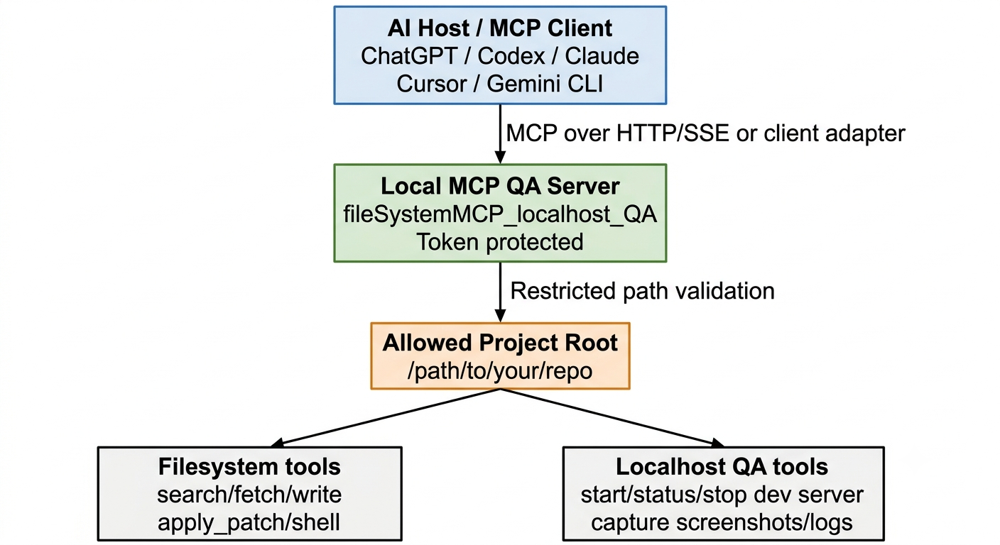

# MCP Localhost QA Starter

[](RELEASES.md)
[](LICENSE)
[](SECURITY.md)
[](https://modelcontextprotocol.io/)

**MCP Localhost QA Starter** is a local, token-protected MCP server for AI-assisted project review, localhost QA, filesystem inspection, shell verification, patch workflows, and browser screenshot evidence capture.

### Let AI agents inspect your local project, run verification commands, start localhost, capture browser screenshots, and save QA evidence safely inside your repo.



It is designed for developers, system architects, business analysts, QA reviewers, and AI-assisted engineering teams who want tools like ChatGPT, Codex, Claude, Cursor, Gemini CLI, or any MCP-compatible client to review a local project safely and produce repo-local QA evidence.

> This project is intended to run locally. Do not expose it publicly without token protection and a clear network boundary.

---

## Documentation index

| File | Purpose |
|---|---|
| [`README.md`](README.md) | Main installation, setup, usage, examples, and project overview |
| [`SECURITY.md`](SECURITY.md) | Security model, safe usage rules, tunnel warning, token rotation, and vulnerability reporting |
| [`RELEASES.md`](RELEASES.md) | Release tag, release title, and GitHub release description |
| [`GITHUB_RELEASE_v1.4.1.md`](GITHUB_RELEASE_v1.4.1.md) | Paste-ready GitHub release body for v1.4.1 |
| [`CHANGELOG.md`](CHANGELOG.md) | Version history and v1.4.1 changes |
| [`CONTRIBUTING.md`](CONTRIBUTING.md) | Contribution rules, pull request expectations, and testing guidance |
| [`LICENSE`](LICENSE) | MIT license |
| [`docs/qa-evidence-workflow.md`](docs/qa-evidence-workflow.md) | Recommended QA evidence folder and report workflow |
| [`examples/`](examples/) | MCP client setup notes, tunnel setup, systemd service, and smoke-test prompts |

---

## What it does

MCP Localhost QA Starter gives an MCP-compatible AI client controlled access to a selected project or repository folder.

The current release supports:

| Area | Tools |
|---|---|
| Filesystem review | `search`, `fetch`, `write_file`, `create_directory`, `delete_file` |
| Command verification | `shell` |
| Patch workflow | `apply_patch` |
| Localhost QA | `start_localhost`, `localhost_status`, `stop_localhost` |
| Browser evidence | `capture_web_screenshot`, `capture_web_screenshot_batch` |

---

## Why use it

Use this project when you want an AI assistant to:

- Inspect project files directly
- Search and fetch source files
- Run short verification commands
- Apply controlled patches
- Start a local development server
- Check localhost health
- Capture browser screenshots with Playwright
- Save QA screenshots and logs inside the repo
- Produce review evidence for milestones, PRDs, QA checks, or architecture reviews

---

## Best for

This project is especially useful for:

- Developers using AI for code review and QA
- System architects reviewing project structure
- Business analysts validating PRD-to-code alignment
- QA reviewers collecting browser evidence
- Product teams using AI-assisted development workflows
- Solo builders who want local repo review without uploading the entire codebase manually

---

## Security model

This tool is powerful because it can expose local project files and run commands inside the selected workspace. The default security model is intentionally local-first.

Security boundaries include:

- Filesystem operations are restricted to the selected project/repo root
- Browser screenshot URLs are restricted to localhost, `127.0.0.1`, or `::1`
- Screenshot and log outputs are written inside the selected workspace
- Token protection is enabled by default
- Public tunneling should only be used with token protection enabled
- `--no-token` is for trusted local testing only and should not be used with public tunnels

Read [`SECURITY.md`](SECURITY.md) before exposing the server through ngrok, Cloudflare Tunnel, SSH tunnel, or any other remote access method.

---

## Included files

Keep these files together in the same folder:

```text
fileSystemMCP_localhost_QA.py
start_mcp_qa.py
start_mcp_qa_windows.bat
README.md
SECURITY.md
RELEASES.md
GITHUB_RELEASE_v1.4.0.md
CHANGELOG.md
CONTRIBUTING.md
LICENSE
```

Recommended supporting folders:

```text
examples/
docs/
.github/ISSUE_TEMPLATE/
```

Do not place these files inside a virtual environment folder. Keep the virtual environment as a sibling folder or in another dedicated location.

---

## Requirements

- Python 3.9+
- Playwright Python package
- Playwright Chromium browser
- An MCP-compatible client
- A local project/repo folder to expose to the MCP server

The starter script can install and verify Playwright in the selected Python environment.

---

## Quick start

### macOS / Linux / WSL

```bash
python3 start_mcp_qa.py "/path/to/your/project"
```

### With a virtual environment

```bash
python3 start_mcp_qa.py "/path/to/your/project" \
  --venv "/path/to/venv" \
  --remember-venv
```

### Linux / WSL with Playwright system dependencies

```bash
python3 start_mcp_qa.py "/path/to/your/project" \
  --venv "/path/to/venv" \
  --remember-venv \
  --with-deps
```

### Windows

Use the Windows starter batch file:

```bat
start_mcp_qa_windows.bat
```

Or run the Python starter directly:

```bat
py start_mcp_qa.py "C:\path\to\your\project"
```

---

## Token behavior

Token protection is enabled by default.

Token source priority:

1. `--token "your-fixed-token"`
2. `MCP_QA_TOKEN` environment variable
3. Auto-generated temporary token

The starter prints an SSE URL like:

```text
http://localhost:8008/sse/?token=YOUR_TOKEN
```

Use this URL in any MCP client that supports SSE endpoints.

For remote testing through a secure tunnel, keep the same path and token after the tunnel domain:

```text
https://YOUR-TUNNEL-DOMAIN/sse/?token=YOUR_TOKEN
```

---

## Common commands

### Start with a fixed token

```bash
export MCP_QA_TOKEN="$(python3 -c 'import secrets; print(secrets.token_urlsafe(32))')"

python3 start_mcp_qa.py "/path/to/your/project" \
  --token "$MCP_QA_TOKEN"
```

### Start on a custom port

```bash
python3 start_mcp_qa.py "/path/to/your/project" \
  --port 8010
```

### Skip dependency installation

```bash
python3 start_mcp_qa.py "/path/to/your/project" \
  --skip-install \
  --skip-browser-install
```

### Upgrade Playwright package

```bash
python3 start_mcp_qa.py "/path/to/your/project" \
  --upgrade
```

---

## Testing token protection

Without token, the server should reject the request:

```bash
curl -i "http://localhost:8008/"
```

With token, the server should respond:

```bash
curl -i "http://localhost:8008/?token=$MCP_QA_TOKEN"
```

Test MCP tool listing:

```bash
curl -s -X POST "http://localhost:8008/sse/?token=$MCP_QA_TOKEN" \
  -H "Content-Type: application/json" \
  -d '{"jsonrpc":"2.0","id":1,"method":"tools/list","params":{}}' | python3 -m json.tool
```

---

## Recommended QA evidence folders

Use repo-local evidence folders:

```text
docs/qa-evidence/<stage-or-smoke-test>/
docs/qa/evidence/screenshots/<stage>/
docs/qa/evidence/logs/
```

All evidence paths must remain inside the selected workspace root.

See [`docs/qa-evidence-workflow.md`](docs/qa-evidence-workflow.md) for a reusable evidence report structure.

---

## MCP client examples

The [`examples/`](examples/) folder includes setup notes and prompts for common MCP workflows.

| Example file | Description |
|---|---|
| [`examples/chatgpt-sse-url.md`](examples/chatgpt-sse-url.md) | ChatGPT SSE URL usage and first prompts |
| [`examples/claude-desktop-config.md`](examples/claude-desktop-config.md) | Claude Desktop local config pattern |
| [`examples/codex-workflow.md`](examples/codex-workflow.md) | Codex-style review and controlled patch prompts |
| [`examples/cursor-setup.md`](examples/cursor-setup.md) | Cursor setup notes and safe prompt pattern |
| [`examples/gemini-cli-setup.md`](examples/gemini-cli-setup.md) | Gemini CLI local server and SSE patterns |
| [`examples/secure-tunnel-ngrok.md`](examples/secure-tunnel-ngrok.md) | ngrok tunnel setup with token protection |
| [`examples/systemd-service.md`](examples/systemd-service.md) | systemd installation and service workflow |
| [`examples/systemd-mcp-localhost-qa.service`](examples/systemd-mcp-localhost-qa.service) | Service file template |
| [`examples/smoke-test-prompts.md`](examples/smoke-test-prompts.md) | Safe smoke-test prompts for QA validation |

---

## Example AI prompts

### Review project structure

```text
Use the MCP filesystem tools to inspect the project structure. Do not modify files. Summarize the architecture, main folders, risks, and missing documentation.
```

### Run a safe smoke test

```text
Use only temporary files under docs/qa-evidence/mcp-smoke-test/. Test search, fetch, write_file, create_directory, delete_file, and report the result. Do not modify real project files.
```

### Capture localhost evidence

```text
Start the local development server, check localhost health, capture screenshots of the home page and main dashboard, and save screenshots under docs/qa/evidence/screenshots/<stage>/.
```

### PRD-to-code review

```text
Review the implementation against the PRD documents. Use read/search/fetch and shell verification only. Do not modify files. Produce a gap report with evidence paths and recommended fixes.
```

### Documentation review

```text
Review README, setup instructions, examples, and security documentation. Do not modify files. Report missing installation steps, unclear assumptions, and risky instructions.
```

---

## Release

Current public release:

```text
v1.4.1
```

See:

- [`RELEASES.md`](RELEASES.md)
- [`GITHUB_RELEASE_v1.4.1.md`](GITHUB_RELEASE_v1.4.1.md)
- [`CHANGELOG.md`](CHANGELOG.md)

---

## Important limitations

- This is a local developer tool, not a hosted SaaS service.
- Public exposure requires careful token and tunnel configuration.
- Shell commands should be used for short verification tasks.
- Long-running dev servers should be started through `start_localhost`.
- Browser screenshots are limited to localhost targets by design.
- The tool does not replace human code review, security review, or QA approval.

---

## Recommended GitHub topics

```text
mcp
mcp-server
model-context-protocol
chatgpt
codex
claude
cursor
gemini-cli
localhost
filesystem
qa-automation
playwright
screenshot-testing
developer-tools
code-review
ai-agents
local-development
```

---

## Contributing

Issues and pull requests are welcome. Before contributing, please read:

- [`SECURITY.md`](SECURITY.md)
- [`CONTRIBUTING.md`](CONTRIBUTING.md)

---

## License

This project is released under the [MIT License](LICENSE).

Before publishing under an organization or company name, update the copyright line in [`LICENSE`](LICENSE) if needed.
